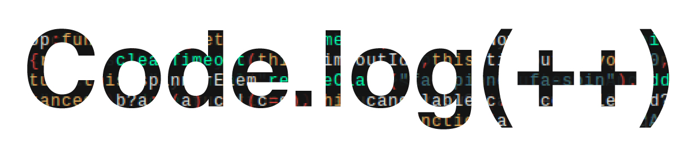

# Back End Project for DigitalCrafts by Michelle Owens, Kyra Mellema, and Prescott Sun. 

The main focus of this project was to show our newly learned back end skills.

We recently started working with Express.js and Node.js as well as databases with PostgreSQL. While working as a team, we divided up work so we could successfully complete the project on time. During presentation, we explained what we incorporated into our project and showed highlights on what we were most proud of.

We used Bulma for our CSS since that was not the main focus of the assignment.

Find Prescott at https://github.com/prescottsun
 
Find Michelle at https://github.com/M-Java86
 
